<p align="center">
  <a href="https://slmkhanahmed.github.io/">
    
  </a>
</p>

<div align="center">
  <h1>
    Hey, I'm Salman Ahmed Khan
    
  </h1>

  <p><strong>Front-end developer · Browser-tool builder · Detail enthusiast</strong></p>
  <p>I build focused interfaces for real problems—then keep refining them until they feel obvious to use.</p>

  <p>
    <a href="https://slmkhanahmed.github.io/">
      
    </a>
    <a href="https://www.linkedin.com/in/slmkhanahmed/">
      
    </a>
    <a href="mailto:slmkhanahmed@gmail.com">
      
    </a>
  </p>
</div>

---

## ✦ What I build

I like software with a clear reason to exist: a missing search feature, an interface that breaks on small screens, or a workflow that needs less friction. My strongest public work combines **React**, **TypeScript**, responsive design, and browser-native APIs.

### ⭐ Git Galaxy Finder

> A Firefox add-on that makes long GitHub Stars lists searchable by repository name and description.

- **Why:** GitHub Stars become difficult to use once the saved list grows.
- **Built with:** React · TypeScript · Primer React · Parcel · WebExtensions Manifest V3
- **Shipped as:** A published Firefox add-on with public source and multiple releases

<p>
  <a href="https://addons.mozilla.org/en-US/firefox/addon/git-star/">
    
  </a>
  <a href="https://github.com/slmkhanahmed/Git-Galaxy-Finder">
    
  </a>
  <a href="https://slmkhanahmed.github.io/#galaxy">
    
  </a>
</p>

### 💡 Product Feedback

> A responsive product-feedback dashboard for scanning, filtering, and sorting requests across screen sizes.

- **Why:** Dense feedback data should stay understandable on desktop, tablet, and mobile.
- **Built with:** React · TypeScript · Tailwind CSS · Context · Vite
- **Includes:** Category filters · Four sorting modes · Responsive feedback cards

<p>
  <a href="https://product-feedback-app-lovat.vercel.app/">
    
  </a>
  <a href="https://github.com/slmkhanahmed/responsive">
    
  </a>
  <a href="https://slmkhanahmed.github.io/#feedback">
    
  </a>
</p>

### 🎛 Interface Field Notes

> My portfolio is also a working interface project: detailed case files, responsive layouts, keyboard navigation, and small interactive labs.

<p>
  <a href="https://slmkhanahmed.github.io/">
    
  </a>
  <a href="https://github.com/slmkhanahmed/slmkhanahmed.github.io">
    
  </a>
</p>

---

## 🛠️ Toolbox

### Core front-end stack

<p>
  
  
  
  
  
  
  
  
</p>

### Exploring and familiar tools

<p>
  
  
  
  
  
  
  
</p>

---

## ⚙️ How I work

- **Start with the friction.** I define the confusing moment before choosing the component.
- **Design the states.** Focus, loading, empty, error, success, and small-screen behavior are part of the feature.
- **Ship, test, refine.** A polished interface is built through iteration, not decoration added at the end.

## 🌱 Current focus

- Making browser extensions feel native to the sites they improve
- Building accessible React interfaces that remain clear under responsive pressure
- Improving project documentation so the decisions are as inspectable as the code

<details>
  <summary><strong>🎮 Engineering side quest — Pekka Kana 2: Greta</strong></summary>
  <br />
  I also contributed focused C++ and SDL2 work to an existing platformer fork, including quick-save/load controls, rendering improvements, and Windows release packaging. The original project and upstream work are fully credited.
  <br /><br />
  <a href="https://github.com/slmkhanahmed/pk2_greta">
    
  </a>
</details>

---

## 📡 Let's connect

Have a useful product idea, a front end that needs more clarity, or a browser workflow worth improving?

**[Explore my portfolio](https://slmkhanahmed.github.io/)** · **[Email me](mailto:slmkhanahmed@gmail.com)** · **[Connect on LinkedIn](https://www.linkedin.com/in/slmkhanahmed/)**

---

## `// after hours`

The tidy part ends above. Down here: **neon streets, old-web relics, too many tabs, and ideas that have not learned to behave.**

<p align="center">
  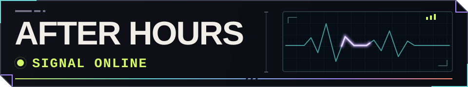
</p>

<p align="center">
  
  <br />
  <sub>The web is still awake somewhere.</sub>
</p>

```text
+-- SYSTEM LOG / 03:17 PKT
| tabs       too many
| battery    critical
| signal     strange
| idea       unstable
`-- ship anyway? y
```

<p align="center">
  <picture>
    <source media="(max-width: 600px)" srcset="./assets/after-hours/midnight-console-mobile.svg" />
    
  </picture>
  <br />
  <sub>somewhere between a clean build and a questionable idea</sub>
</p>

<p align="center">
  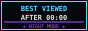
  
  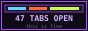
  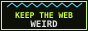
  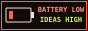
  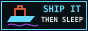
  <br />
  <sub>certified by nobody · displayed proudly anyway</sub>
</p>

<p align="center"><code>50 more signals detected:</code></p>

<p align="center">
  <picture>
    <source media="(max-width: 600px)" srcset="./assets/after-hours/fifty-signals-mobile.svg" />
    
  </picture>
  <br />
  <sub>the badge drawer would not close</sub>
</p>

<p align="center"><code>one impossible tab remains:</code></p>

<p align="center">
  <picture>
    <source media="(max-width: 600px)" srcset="./assets/after-hours/last-tab-mobile.svg" />
    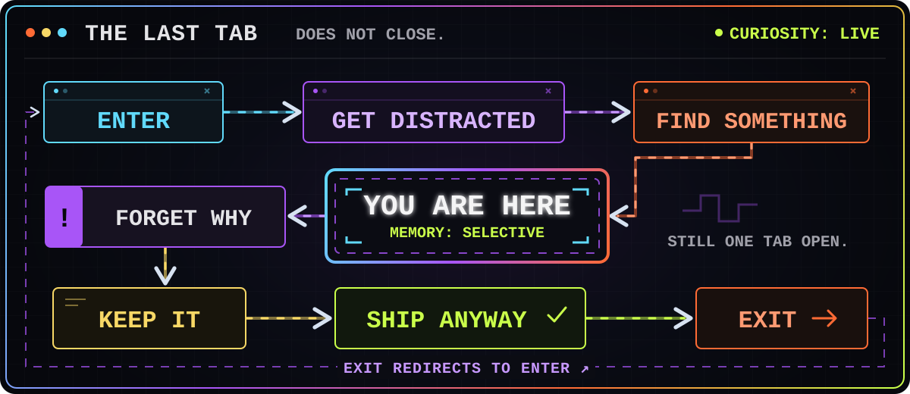
  </picture>
  <br />
  <sub>you are not lost. the map is just honest.</sub>
</p>

<p align="center"><code>24 CHANNELS FOUND // ALL OF THEM MOVING</code></p>

A 24-step transmission moves from boot errors through escaped pixel processes and finally into full-frame signal failure.

<p align="center"><code>ACT I // BOOT SEQUENCE REFUSES TO FINISH</code></p>

<p align="center">
  
  <br />
  <sub>01 // still loading the part that was supposed to be finished</sub>
</p>

<p align="left">
  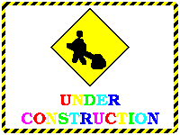
  <br />
  <sub>02 // permanent construction is a feature</sub>
</p>

<p align="right">
  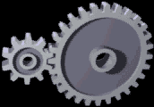
  <br />
  <sub>03 // backend thinking loudly</sub>
</p>

<p align="center">
  
  <br />
  <sub>04 // progress reached 100% and kept going</sub>
</p>

<p align="center"><code>ACT II // PROCESSES ESCAPE</code></p>

<p align="left">
  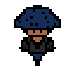
  <br />
  <sub>05 // process 404 found a hat and left</sub>
</p>

<p align="right">
  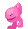
  <br />
  <sub>06 // friendly malware entered the tab</sub>
</p>

<p align="center">
  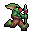
  <br />
  <sub>07 // the cache escaped on foot</sub>
</p>

<p align="left">
  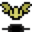
  <br />
  <sub>08 // background service learned to fly</sub>
</p>

<p align="center"><code>ACT III // INPUT HAZARDS</code></p>

<p align="right">
  
  <br />
  <sub>09 // one more refresh. heads wins either way.</sub>
</p>

<p align="center">
  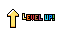
  <br />
  <sub>10 // achievement unlocked: made it stranger</sub>
</p>

<p align="left">
  
  <br />
  <sub>11 // unexpected markup from below</sub>
</p>

<p align="right">
  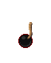
  <br />
  <sub>12 // this button was absolutely production-safe</sub>
</p>

<p align="center"><code>ACT IV // SIGNAL GAINS TEETH</code></p>

<p align="center">
  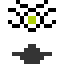
  <br />
  <sub>13 // the page is looking back</sub>
</p>

<p align="left">
  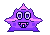
  <br />
  <sub>14 // a harmless star, according to the star</sub>
</p>

<p align="right">
  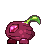
  <br />
  <sub>15 // local produce became hostile</sub>
</p>

<p align="center">
  
  <br />
  <sub>16 // the browser noticed you noticing it</sub>
</p>

<p align="center"><code>ACT V // GRAVITY UNINSTALLED</code></p>

<p align="left">
  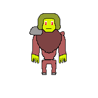
  <br />
  <sub>17 // top is temporarily down</sub>
</p>

<p align="right">
  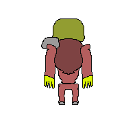
  <br />
  <sub>18 // down filed an appeal</sub>
</p>

<p align="center">
  
  <br />
  <sub>19 // browser temperature: electric blue</sub>
</p>

<p align="left">
  
  <br />
  <sub>20 // production-safe for almost a second</sub>
</p>

<p align="center"><code>ACT VI // NO CARRIER</code></p>

<p align="right">
  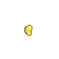
  <br />
  <sub>21 // the loading state discovered violence</sub>
</p>

<p align="center">
  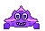
  <br />
  <sub>22 // one final process ended itself</sub>
</p>

<p align="right">
  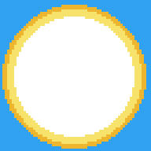
  <br />
  <sub>23 // the exception became the whole screen</sub>
</p>

<p align="center">
  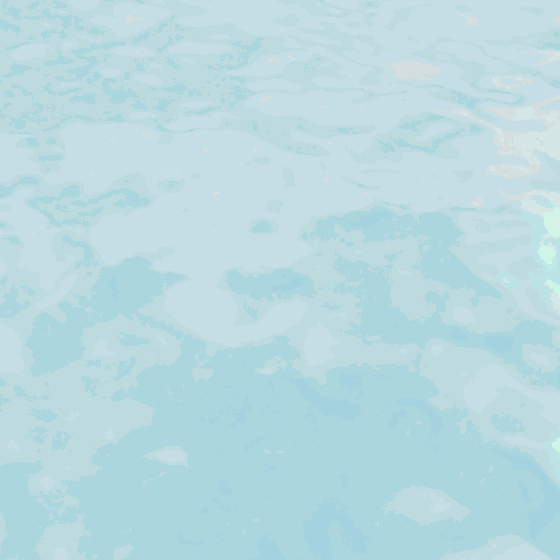
  <br />
  <sub>24 // NO CARRIER // the signal refused to die</sub>
</p>

<p align="center"><code>signal spill:</code></p>

<div align="center">
  
  
  
  
  
  
  
  
  
  
  
  
  
  
  
  
  
  
  
  
  
  
  
  

  <br />
  <sub>connection kept alive by curiosity</sub>
</div>

<p align="center">
  <code>END OF LINE // KEEP THE WEB WEIRD // SEE YOU AFTER MIDNIGHT</code>
  <br />
  <sub>carrier lost at 03:31 PKT ░▒▓</sub>
</p>
