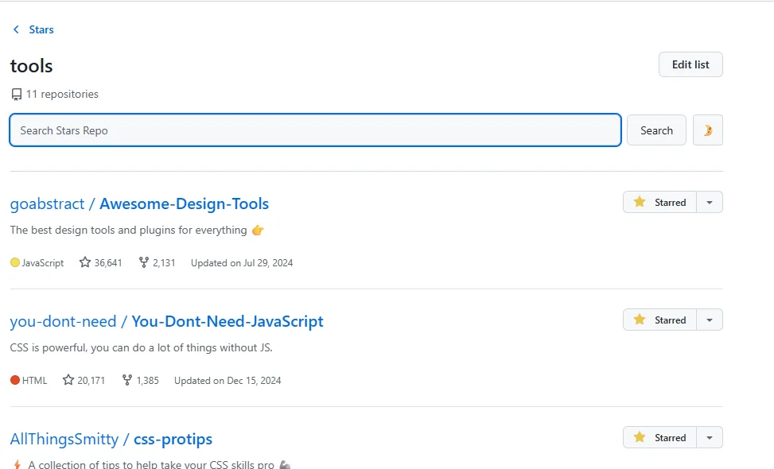
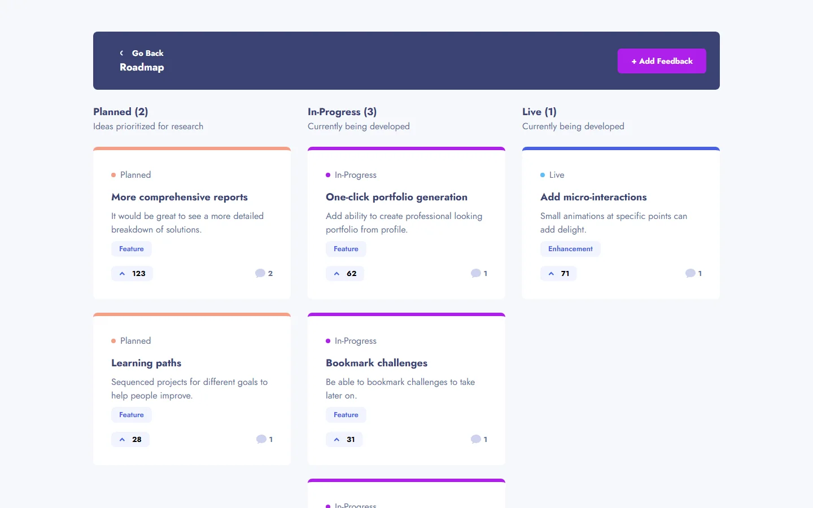

  

  

<h1 align="center">Salman Ahmed Khan</h1>

  <strong>Front-end developer · Browser-tool builder</strong>

  I turn practical problems into focused React interfaces—responsive, keyboard-minded, and refined down to the interaction states.

  <a href="https://slmkhanahmed.github.io/"><strong>Portfolio</strong></a>
  &nbsp;·&nbsp;
  <a href="mailto:slmkhanahmed@gmail.com"><strong>Email</strong></a>
  &nbsp;·&nbsp;
  <a href="https://www.linkedin.com/in/slmkhanahmed/"><strong>LinkedIn</strong></a>

---

## Selected work

The clearest picture of how I work is in the interfaces themselves.

### 01 / Git Galaxy Finder

<a href="https://addons.mozilla.org/en-US/firefox/addon/git-star/">
  <picture>
    <source media="(prefers-reduced-motion: reduce)" srcset="./assets/git-galaxy-static.webp" />
    
  </picture>
</a>

A Firefox add-on that adds search directly to GitHub Stars, making saved repositories discoverable by name and description.

- **Problem:** Long Stars lists are useful to collect and frustrating to retrieve from.
- **Interaction:** The search UI follows GitHub's light and dark themes and survives its single-page navigation.
- **Built with:** React · TypeScript · Primer React · Parcel · WebExtensions Manifest V3
- **Shipped as:** A published Firefox add-on with public source and multiple releases.

**[Install on Firefox](https://addons.mozilla.org/en-US/firefox/addon/git-star/)** · **[View public source](https://github.com/slmkhanahmed/Git-Galaxy-Finder)** · **[Read the case study](https://slmkhanahmed.github.io/#galaxy)**

### 02 / Product Feedback

A responsive implementation of Frontend Mentor's Product Feedback App challenge, built to keep a dense workflow clear from desktop to phone width.

- **Implementation:** Category filtering · Four sorting modes · Responsive feedback cards · Roadmap states
- **Built with:** React · TypeScript · Tailwind CSS · Context
- **Credit:** Interface brief and supplied design assets by Frontend Mentor; responsive implementation and interaction code by me.

**[Open the live implementation](https://product-feedback-app-lovat.vercel.app/)** · **[View the repository](https://github.com/slmkhanahmed/responsive)** · **[See the original challenge](https://www.frontendmentor.io/challenges/product-feedback-app-wbvUYqjR6)** · **[Read the case study](https://slmkhanahmed.github.io/#feedback)**

### 03 / Interface Field Notes

My portfolio is also an interface project: an editorial case-file system with responsive navigation, keyboard shortcuts, project evidence, and small interactive labs.

**[Explore the portfolio](https://slmkhanahmed.github.io/)** · **[Inspect the source](https://github.com/slmkhanahmed/slmkhanahmed.github.io)**

---

## How I build

- **Start with the friction.** Define the confusing moment before choosing a component.
- **Design the states.** Focus, loading, empty, error, success, and small-screen behavior belong to the feature.
- **Ship and inspect.** Test the real interface, document the decision, and refine what still feels unclear.

## Tools I reach for

  
  
  
  
  
  
  
  
  

## Engineering side quest

I also contributed focused C++ and SDL2 work to a fork of **Pekka Kana 2: Greta**—including quick-save/load controls, rendering improvements, and a verified Windows x64 release package. The original game and upstream project remain fully credited.

**[Inspect my fork](https://github.com/slmkhanahmed/pk2_greta)** · **[View the v0.341 Windows release](https://github.com/slmkhanahmed/pk2_greta/releases/tag/v0.341)** · **[Visit the upstream project](https://github.com/SaturninTheAlien/pk2_greta)**

---

## Let's make something useful

Have a browser workflow worth improving or a front end that needs more clarity?

**[Explore my portfolio](https://slmkhanahmed.github.io/)** · **[Email me about a project](mailto:slmkhanahmed@gmail.com)** · **[Connect on LinkedIn](https://www.linkedin.com/in/slmkhanahmed/)**

---

## `// after hours`

The polished part ends here. The curiosity doesn't.

  
  
  
  
  
  
  
  
  
  
  
  
  
  
  
  
  
  
  
  
  
  
  
  

   
  Small experiments, strange ideas, and useful things built because they should exist.

