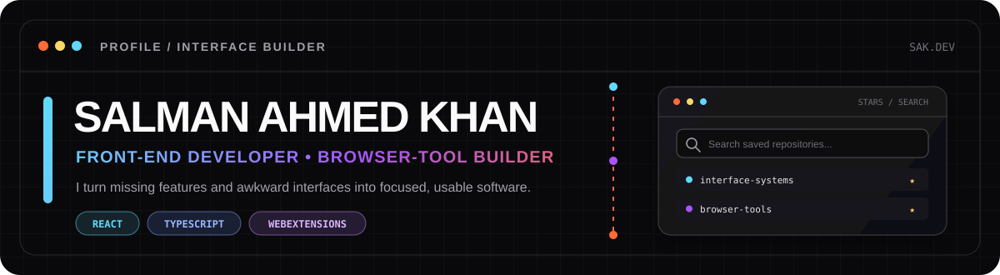
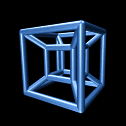
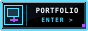
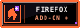
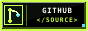
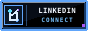
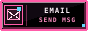

  <a href="https://slmkhanahmed.github.io/">
    <picture>
      <source media="(prefers-color-scheme: dark)" srcset="./assets/profile-header-dark.svg" />
      <source media="(prefers-color-scheme: light)" srcset="./assets/profile-header-light.svg" />
      
    </picture>
  </a>

  <h1>Hey, I'm Salman Ahmed Khan.</h1>

  
<strong>Full-stack developer · AI automation builder · Head of IT &amp; Automation</strong>

  
I build practical software, intelligent workflows, and reliable systems for real operational problems.

  

    
    
    
  

---

## ✦ What I build

I work where software meets operations: full-stack applications, browser tools, AI-assisted automation, databases, infrastructure, and software-to-hardware integration. My public projects remain rooted in **React**, **TypeScript**, responsive design, and browser-native APIs, while my current professional work spans a much broader technical environment.

### ⭐ Git Galaxy Finder

> A Firefox add-on that makes long GitHub Stars lists searchable by repository name and description.

- **Why:** GitHub Stars become difficult to use once the saved list grows.
- **Built with:** React · TypeScript · Primer React · Parcel · WebExtensions Manifest V3
- **Shipped as:** A published Firefox add-on with public source and multiple releases

  
  
  

### 💡 Product Feedback

> A responsive product-feedback dashboard for scanning, filtering, and sorting requests across screen sizes.

- **Why:** Dense feedback data should stay understandable on desktop, tablet, and mobile.
- **Built with:** React · TypeScript · Tailwind CSS · Context · Vite
- **Includes:** Category filters · Four sorting modes · Responsive feedback cards

  
  
  

### 🎛 Interface Field Notes

> My portfolio is also a working interface project: detailed case files, responsive layouts, keyboard navigation, and small interactive labs.

  
  

---

## 🧭 Current role

### Head of IT &amp; Automation · LotiaSons

I lead hands-on technology work across business and industrial environments, including:

- IT infrastructure, Windows systems, networking, FortiGate security, NAS, and remote access
- Microsoft SQL Server migration, configuration, backup, recovery, and reliability
- Local LLMs, Ollama, Model Context Protocol (MCP), and autonomous workflows
- PowerShell automation and systems integration across existing business applications
- CNC and plasma systems, motion control, sensors, CAD/CAM, G-code, and software-to-hardware troubleshooting
- Technical research, procurement, and coordination with local and international vendors

The role combines software development, IT operations, AI integration, automation, and root-cause problem solving.

---

## 🛠️ Toolbox

**Software development:** `React` · `TypeScript` · `JavaScript` · `Node.js` · `HTML` · `CSS` · `Tailwind CSS`

**AI and automation:** `LLM Integration` · `MCP` · `Ollama` · `PowerShell` · `REST APIs`

**Data and infrastructure:** `Microsoft SQL Server` · `MySQL` · `MongoDB` · `Windows` · `NAS` · `Fortinet`

**Browser and build work:** `Firefox WebExtensions` · `Vite` · `Parcel` · `Primer React` · `Redux`

**Industrial workflows:** `Rhino` · `DesignEdge` · `MachPro` · `PolyBoard` · `G-code` · `CNC / Plasma`

**Everyday tools:** `Git` · `GitHub` · `Bash` · `Figma`

---

## ⚙️ How I work

- **Trace the full system.** I follow a problem across software, network, database, controller, and hardware boundaries before changing anything.
- **Build for operation.** Reliability, recovery, maintainability, and clear documentation are part of the solution.
- **Automate repetition.** I use scripts and AI where they reduce manual effort and prevent avoidable errors.
- **Test, measure, refine.** I validate outcomes against real behavior, not assumptions.

## 🌱 Current focus

- Building AI and MCP integrations for real business workflows
- Modernizing database, backup, network, and security operations
- Connecting software with CAD/CAM and industrial equipment
- Continuing full-stack, browser-extension, and open-source development

  
<strong>🎮 Engineering side quest — Pekka Kana 2: Greta</strong>

   
  I also contributed focused C++ and SDL2 work to an existing platformer fork, including quick-save/load controls, rendering improvements, and Windows release packaging. The original project and upstream work are fully credited.
    
  

---

## 📡 Let's connect

Have a useful software idea, an operation worth automating, or a complex system that needs a clearer path forward?

**[Explore my portfolio](https://slmkhanahmed.github.io/)** · **[Email me](mailto:slmkhanahmed@gmail.com)** · **[Connect on LinkedIn](https://www.linkedin.com/in/slmkhanahmed/)**

---

## `// after hours`

The tidy part ends above. Down here: **neon streets, old-web relics, too many tabs, and ideas that have not learned to behave.**

  
   
  The web is still awake somewhere.

  
   
  frequency locked · curiosity online

  
<strong><code>OPEN SIGNAL ARCHIVE</code></strong> · console and signal spill

   

  

    <picture>
      <source media="(max-width: 600px)" srcset="./assets/after-hours/midnight-console-mobile.svg?v=2" />
      
    </picture>
     
    clean build on one screen · questionable idea on the other
  

<code>signal spill:</code>

  
  
  
  
  
  
  
  
  
  
  
  
  
  
  
  
  
  
  
  
  
  
  
  

   
  connection kept alive by curiosity

---

  <strong><code>ANOMALY 04</code></strong>
   
  
    TAB GEOMETRY EXCEEDS DISPLAY CAPABILITIES
     
    ATTEMPTING FOUR-DIMENSIONAL RECOVERY…
  

  <picture>
    <source media="(prefers-reduced-motion: reduce)" srcset="./assets/after-hours/tesseract-static.png" />
    
  </picture>
   
  one unstable tab · zero user action required

  <strong><code>ONE IMPOSSIBLE TAB REMAINS</code></strong>

  <picture>
    <source media="(max-width: 600px)" srcset="./assets/after-hours/last-tab-mobile.svg?v=2" />
    
  </picture>
   
  you are not lost · the map is just honest

  <code>CARRIER LOST · CURIOSITY REMAINS</code>
   
  03:31 PKT ░▒▓

<!--
YOU FOUND THE MAINTENANCE CHANNEL.

The visible interface is stable.
One additional tab remains open.
-->

  <strong><code>AUTHORIZED EXITS</code></strong>

  
  
  
  
  

  
<strong><code>SOURCE OF SIGNALS // ASSET CREDITS</code></strong>

### Original artwork

- The profile headers, signal board, midnight console, fifty-signal wall, impossible-tab map, and authorized-exit buttons are custom artwork created for this profile.
- The desktop and mobile compositions use only repository-local SVG assets.

### Third-party artwork

- [“Neon streets” by JINDONG H](https://commons.wikimedia.org/wiki/File:Neon_streets_(Unsplash).jpg) — CC0 1.0.
- [“Tesseract.gif” by Jason Hise](https://commons.wikimedia.org/wiki/File:Tesseract.gif) — public domain.

### Project-derived game assets

- [“fish” by kotnaszynce](https://opengameart.org/content/fish-0) — CC0; stored as `spectral-fish.gif`.
- [“potion” by kotnaszynce](https://opengameart.org/content/potion-1) — CC0; stored as `moon-potion.gif`.
- [“Fire Slime” by Spring Spring](https://opengameart.org/content/fire-slime) — CC0; stored as `fire-slime.gif`.
- [“Little Servant Devil Animation” by ArtsyAngelee](https://opengameart.org/content/little-servant-devil-animation) — the source page offers CC0 among several licenses; stored as `little-devil.gif`.
- Remaining legacy sprites and effects in `assets/after-hours/channels/`: **Source or license requires verification.**

### Modified assets

- `tesseract-static.png` is a still-frame reduced-motion fallback derived from the public-domain tesseract animation.
- The `*-mobile.svg` files are narrow-layout adaptations of their matching custom desktop artwork.

### External animation collections

- The collapsed signal spill uses animations from [Cult of the Party Parrot](https://github.com/jmhobbs/cultofthepartyparrot.com). See the project's [license and provenance notes](https://github.com/jmhobbs/cultofthepartyparrot.com/blob/main/LICENSE).

### RETURN TO DAYLIGHT

**[Portfolio](https://slmkhanahmed.github.io/)** · **[Featured projects](#featured-projects)** · **[Email](mailto:slmkhanahmed@gmail.com)** · **[LinkedIn](https://www.linkedin.com/in/slmkhanahmed/)**
