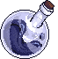
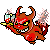
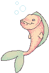
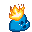

  

  <h1>
    Hey, I'm Salman Ahmed Khan
    
  </h1>

  
<strong>Front-end developer · Browser-tool builder · Detail enthusiast</strong>

  
I build focused interfaces for real problems—then keep refining them until they feel obvious to use.

  

    
    
    
  

---

## ✦ What I build

I like software with a clear reason to exist: a missing search feature, an interface that breaks on small screens, or a workflow that needs less friction. My strongest public work combines **React**, **TypeScript**, responsive design, and browser-native APIs.

### ⭐ Git Galaxy Finder

> A Firefox add-on that makes long GitHub Stars lists searchable by repository name and description.

- **Why:** GitHub Stars become difficult to use once the saved list grows.
- **Built with:** React · TypeScript · Primer React · Parcel · WebExtensions Manifest V3
- **Shipped as:** A published Firefox add-on with public source and multiple releases

  
  
  

### 💡 Product Feedback

> A responsive product-feedback dashboard for scanning, filtering, and sorting requests across screen sizes.

- **Why:** Dense feedback data should stay understandable on desktop, tablet, and mobile.
- **Built with:** React · TypeScript · Tailwind CSS · Context · Vite
- **Includes:** Category filters · Four sorting modes · Responsive feedback cards

  
  
  

### 🎛 Interface Field Notes

> My portfolio is also a working interface project: detailed case files, responsive layouts, keyboard navigation, and small interactive labs.

  
  

---

## 🛠️ Toolbox

### Core front-end stack

  
  
  
  
  
  
  
  

### Exploring and familiar tools

  
  
  
  
  
  
  

---

## ⚙️ How I work

- **Start with the friction.** I define the confusing moment before choosing the component.
- **Design the states.** Focus, loading, empty, error, success, and small-screen behavior are part of the feature.
- **Ship, test, refine.** A polished interface is built through iteration, not decoration added at the end.

## 🌱 Current focus

- Making browser extensions feel native to the sites they improve
- Building accessible React interfaces that remain clear under responsive pressure
- Improving project documentation so the decisions are as inspectable as the code

  
<strong>🎮 Engineering side quest — Pekka Kana 2: Greta</strong>

   
  I also contributed focused C++ and SDL2 work to an existing platformer fork, including quick-save/load controls, rendering improvements, and Windows release packaging. The original project and upstream work are fully credited.
    
  

---

## 📡 Let's connect

Have a useful product idea, a front end that needs more clarity, or a browser workflow worth improving?

**[Explore my portfolio](https://slmkhanahmed.github.io/)** · **[Email me](mailto:slmkhanahmed@gmail.com)** · **[Connect on LinkedIn](https://www.linkedin.com/in/slmkhanahmed/)**

---

## `// after hours`

The tidy part ends above. Down here: **neon streets, old-web relics, too many tabs, and ideas that have not learned to behave.**

  
   
  The web is still awake somewhere.

  
   
  frequency locked · curiosity online

  <picture>
    <source media="(max-width: 600px)" srcset="./assets/after-hours/midnight-console-mobile.svg?v=2" />
    
  </picture>
   
  clean build on one screen · questionable idea on the other

---

  <strong><code>24 MOTION CHANNELS // SIX ACTS</code></strong>
   
  one signal at a time · no grid · no quiet frames

  <strong><code>01 / BOOT</code></strong>
   
  the sequence refuses to finish

  
   
  booting dimensions one through four

  
   
  the build is still brewing

  
   
  thinking, audibly

  
   
  progress exceeded available width

---

  <strong><code>02 / ESCAPE</code></strong>
   
  the processes leave without signing out

  
   
  process 404 found a hat

  
   
  the cache left on foot

  
   
  friendly malware entered

  
   
  background service grew wings

---

  <strong><code>03 / INPUT</code></strong>
   
  every click has consequences

  
   
  one more refresh

  
   
  made it stranger

  
   
  markup from below

  
   
  production-safe, briefly

---

  <strong><code>04 / OBSERVERS</code></strong>
   
  the signal starts looking back

  
   
  the page is looking back

  
   
  dependency requested admin access

  
   
  the signal learned to swim

  
   
  it noticed you noticing it

---

  <strong><code>05 / GRAVITY</code></strong>
   
  orientation is now a suggestion

  
   
  top is temporarily down

  
   
  down filed an appeal

  
   
  browser temperature: blue

  
   
  a small, controlled exception

---

  <strong><code>06 / FAILURE</code></strong>
   
  the clean exit has been cancelled

  
   
  loading state lost patience

  
   
  incident response caught fire

  
   
  the exception filled the viewport

  
   
  NO CARRIER // still moving

---

  <strong><code>ARCHIVE UNLOCKED // 50 SIGNALS</code></strong>

  <picture>
    <source media="(max-width: 600px)" srcset="./assets/after-hours/fifty-signals-mobile.svg?v=2" />
    
  </picture>
   
  the badge drawer would not close

  <strong><code>ONE IMPOSSIBLE TAB REMAINS</code></strong>

  <picture>
    <source media="(max-width: 600px)" srcset="./assets/after-hours/last-tab-mobile.svg?v=2" />
    
  </picture>
   
  you are not lost · the map is just honest

  <code>END OF LINE // SIGNAL LOST // CURIOSITY REMAINS</code>
   
  carrier lost at 03:31 PKT ░▒▓

