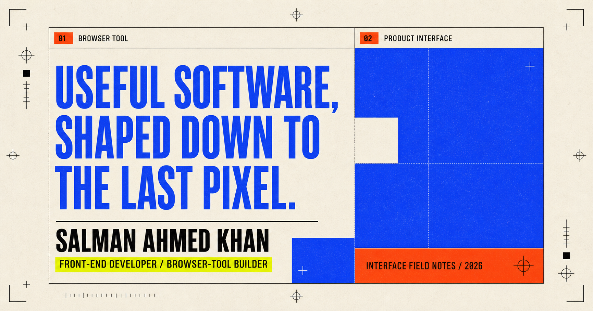

  

# Salman Ahmed Khan

**Front-end developer building browser tools and responsive product interfaces.**

I notice the missing feature, the awkward state, and the layout that stops making sense on a small screen—then build the clearer path. My work sits between visual clarity and dependable engineering.

[**Explore my portfolio →**](https://slmkhanahmed.github.io/) · [Email me](mailto:slmkhanahmed@gmail.com) · [Connect on LinkedIn](https://www.linkedin.com/in/slmkhanahmed/)

## Selected field notes

### `01 / BROWSER TOOL` — [Git Galaxy Finder](https://github.com/slmkhanahmed/Git-Galaxy-Finder)

**Problem** — GitHub Stars are useful until a long saved list becomes difficult to search.

**Decision** — Add a focused, theme-aware search experience directly to GitHub while respecting client-side navigation and the host interface.

**Shipped** — A TypeScript and React browser extension published for Firefox and refined through multiple public releases.

[Install on Firefox](https://addons.mozilla.org/en-US/firefox/addon/git-star/) · [Inspect the source](https://github.com/slmkhanahmed/Git-Galaxy-Finder) · [Read the case study](https://slmkhanahmed.github.io/#galaxy)

### `02 / PRODUCT INTERFACE` — [Product Feedback](https://github.com/slmkhanahmed/responsive)

**Problem** — Dense product-feedback data needs to stay easy to scan, filter, and sort on every screen.

**Decision** — Use reusable feedback cards plus consistent category and sorting controls across responsive layout modes.

**Shipped** — A responsive React, TypeScript, and Tailwind CSS dashboard with category filters and four sorting modes.

[Open the application](https://product-feedback-app-lovat.vercel.app/) · [Inspect the source](https://github.com/slmkhanahmed/responsive) · [Read the case study](https://slmkhanahmed.github.io/#feedback)

### `03 / THIS PORTFOLIO` — [Interface Field Notes](https://slmkhanahmed.github.io/)

A deliberately editorial React portfolio with working interaction demos, keyboard navigation, detailed case files, and responsive behavior tested down to 320px.

[Visit the site](https://slmkhanahmed.github.io/) · [Inspect the source](https://github.com/slmkhanahmed/slmkhanahmed.github.io)

## How I build

- **Start with the friction.** Name the confusing moment before choosing a component.
- **Design every state.** Loading, empty, error, focus, and success are product work.
- **Pressure-test the interface.** Keyboard use and narrow screens are part of the design, not a final check.

**Core toolkit:** `TypeScript` · `React` · `JavaScript` · `CSS` · `Tailwind CSS` · `WebExtensions` · `DOM APIs` · `Git`

<strong>Engineering side quest — Pekka Kana 2: Greta</strong>

I also contributed focused C++ and SDL2 work to an existing platformer fork, including quick-save and load controls, rendering improvements, and Windows release packaging. This is a credited upstream fork—not a from-scratch project.

[Inspect the contribution](https://github.com/slmkhanahmed/pk2_greta)

## Current focus — July 2026

Building and documenting interfaces where the design decisions, working code, and public proof all tell the same story.

If you have a useful product idea, a front end that needs more clarity, or a browser workflow worth improving, [send me a note](mailto:slmkhanahmed@gmail.com).

Built like the interfaces I value: useful, clear, and tested.
